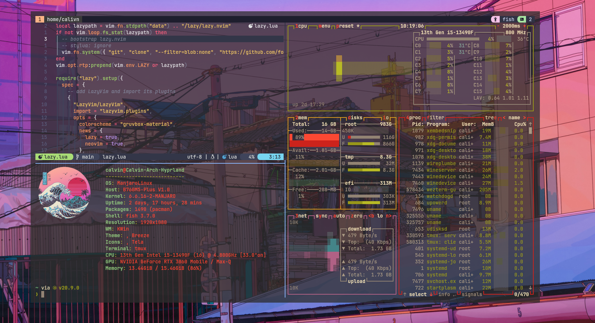
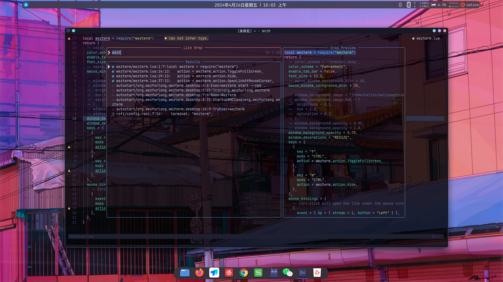
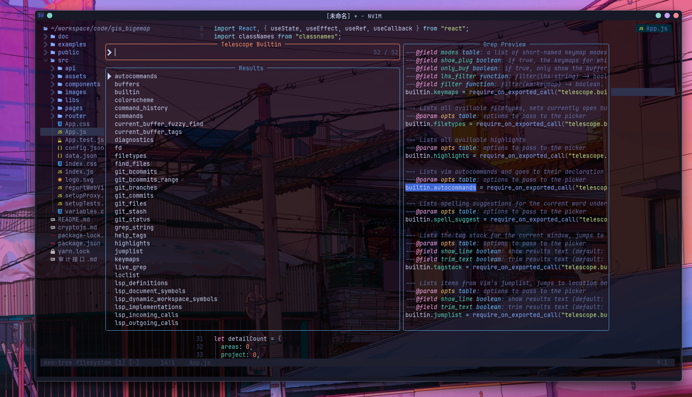
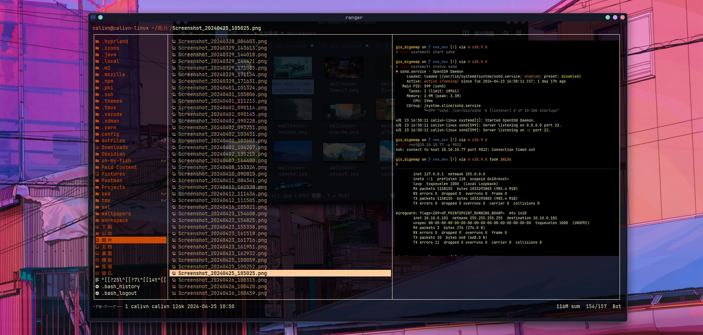
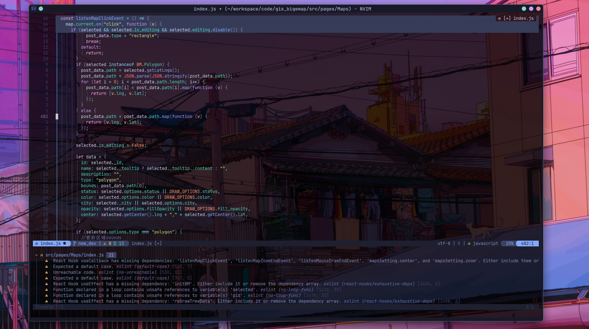
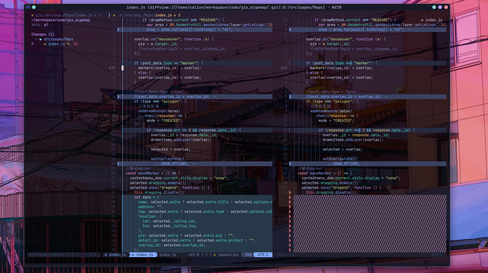

---

# Calvin's dotfiles

**Warning**: Don’t blindly use my settings unless you know what that entails. Use at your own risk!

#### Required

- NeoVim >= **0,9,0**
- Git >= **2.19.0**
- [lazyvim](https://www.lazy.org/)
- [lazygit](https://github.com/jesseduffield/lazygit) **_(optional)_**
- [ranger](https://github.com/ranger/ranger/)
- [tmux](https://github.com/tmux-plugins/)
- a [Nerd Font](https://www.nerdfonts.com/)(v3.0 or greater) **_(optional, but needed to display some icons)_**
  a terminal that support true color and _undercurl_:
- [kitty](https://github.com/kovidgoyal/kitty) **_(Linux & Macos)_**
- [wezterm](https://github.com/wez/wezterm) **_(Linux, Macos & Windows)_**
- [alacritty](https://github.com/alacritty/alacritty) **_(Linux, Macos & Windows)_**
